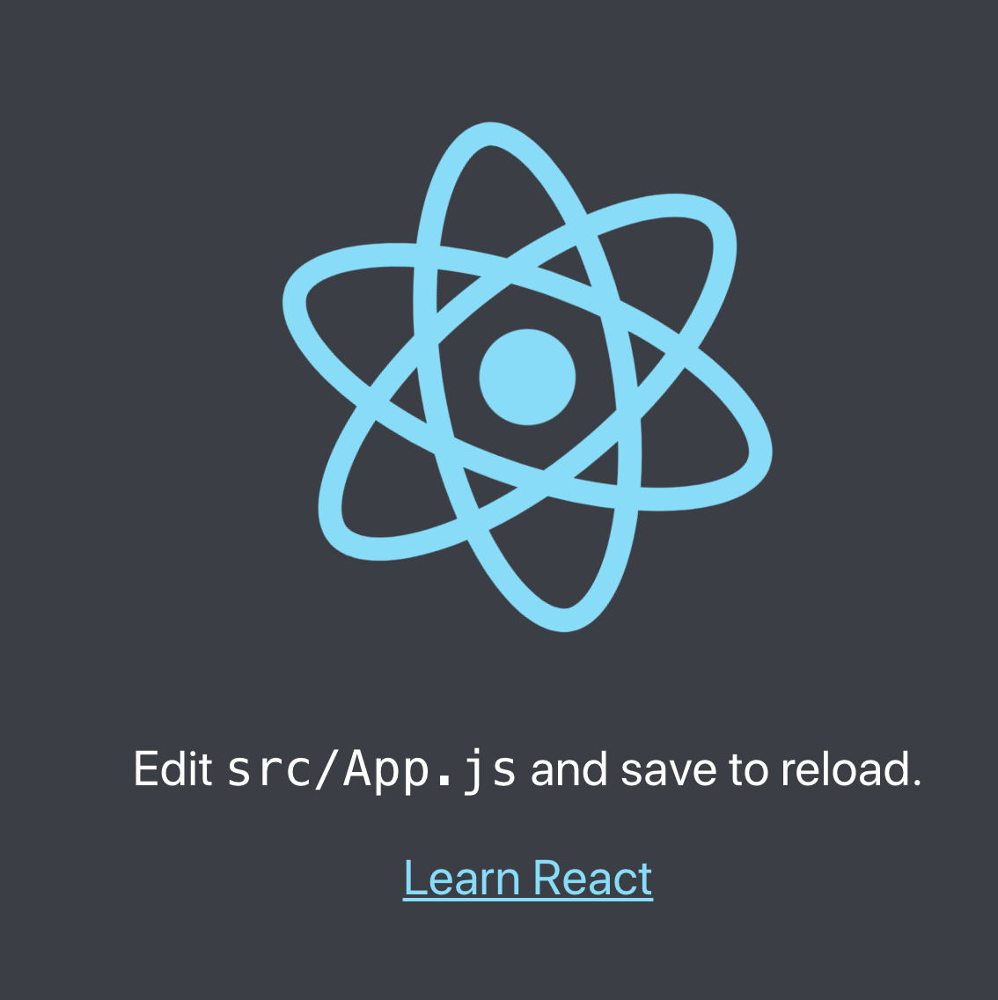

# Set up

Follow me on [Twitter](https://twitter.com/chris_noring), happy to take your suggestions on topics or improvements /Chris

There are many ways to set up a new React project like:

- **Script tags**, it is possible to just use script tags and point to React, React DOM and Babel.
- **CRA, Create React App**, this tool helps us generate a React project. This is probably the most common set up.
- **Do it yourself**, it's definitely possible to set everything up with a tool like Webpack.

## Script tags

This version is simplest to start with if you are a beginner. It enables you to dive straight into React and learn its features.

### 📌 Create a React project with script tags and CDN.

1. Create a file _app.js_ and give it the following content:

    ```js
    // app.js
    
    class Application extends React.Component {
      render() {
        return (
          <div>
          App
          </div>
        );
      }
    }
    
    ReactDOM.render(<Application />, document.getElementById('app'));
    ```

1. Next, create a file _index.html_ and give it this content:

    ```html
    <!-- index.html -->
    
    <html>
      <body>
      <!-- This is where our app will live -->
        <div id="app"></div>
    
      <!-- These are script tags we need for React, JSX and ES2015 features -->
      <script src="https://fb.me/react-15.0.0.js"></script>
      <script src="https://fb.me/react-dom-15.0.0.js"></script>
      <script src="https://cdnjs.cloudflare.com/ajax/libs/babel-core/5.8.34/browser.min.js"></script>
      <script type="text/babel" src="app.js"></script>
    </body>
    
    </html>
    ```

    You should now have an app with the following files:

    ```output
    -| app.js
    -| index.html
    ```

1. Run `npx http-server -5000` in the terminal:

   ```bash
   npx http-server -p 5000
   ```

   This will serve up your application on `http://localhost:5000`.

1. Navigate to `http://localhost:5000` in your browser, you should see the text **App**.

> The drawbacks to the above approach is that everything is compiled at runtime which is horribly slow but its great for learning React - but please don't put it like this in production.

## create-react-app

Create React App, CRA is a scaffolder developed by Dan Abramov. With it you are able to scaffold a React application with ease and will get you up and running in no time.

### 📌 Create a React project using npx and Create React App

To scaffold a project using `npx` and Create React App it's just a one liner command.

1. Create a new React project running this command in a terminal:

    ```bash
    npx create-react-app my-app
    ```

   > Currently you need Node >= 8.10 and NPM >= 5.6 on your machine.

1. Navigate to your project

   ```bash
   cd my-app
   ```

1. Run the following command to serve it up:

   ```bash
   yarn start
   ```

   This starts a development server at `http://localhost:3000`.

1. In your browser, navigate to `http://localhost:3000`. You should see the following:

     

`create-react-app` is a very active project and can truly help you in the beginning of you learning React and even later. Question is really how much you want to be able to configure your project. When you become skilled enough you may come to a point when you don't need create-react-app, but until that point, it is your friend. You can read more on it in the official documentation, [https://github.com/facebook/create-react-app](https://github.com/facebook/create-react-app)

## Do it yourself

Sooner or later you will find yourself using Webpack and setting up React using Webpack is relatively easy. So therefore I'll take you through how you can do just that. You will need the following:

- **Node.js installed**. With Node.js you will fetch different libraries that you need.
- **Webpack**. You will download webpack as part of this guide and also create a configuration file for it.
- **Babel**. Babel helps you add functionality to JavaScript, features that might not yet be supported. One thing Babel will do for us to transform JSX files to Vanilla JavaScript

### 📌 -1- Create a Webpack project

Webpack is a static module bundler. It takes your code, and turns it into one or many bundles. What it does is to build up a dependency graphs, while it crawls your code and creates the bundles you've instructed it to create. It's common to start with one bundle and over time creating more specific bundles for things libraries, and things that you want to _lazy load_.

Webpack can also be instructed to manage parts of your code and turn it into something the web can interpret. You can for example turn:

- **JSX into Vanilla JavaScript**. This is something you will need as React uses JSX.
- **SCSS into CSS**. SCSS is something that's been used for a long time to make CSS easier to manage. It provides things such as modules, variables and utility functions. Now the Web has evolved and many of these features are offered in pure CSS.

1. To create a Webpack project, start by creating the following directories and files

   ```output
   mkdir src
   mkdir dist
   cd src
   touch index.js
   cd ..
   cd dist
   touch index.html
   ```

1. Initialize a Node.js project by running `npm init -y` at the root:

   ```bash
   npm init -y
   ```

    You should now have the following:

   ```output
   -| src/
   ---| index.js
   -| dist/
   ---| index.html 
   -| package.json
   ```

1. Give the file _index.html_ the following content:

   ```html
   <!DOCTYPE html>
    <html>
      <head>
        <title>Hello App</title>
      </head>
      <body>
        <div>
          <h1>Hello App</h1>
        </div>
        <script src="./bundle.js"></script>
      </body>
    </html>
   ```

   The referred to _bundle.js_ will be created by Webpack, so don't worry about that one.

1. Give the file _index.js_ the following content:

   ```javascript
   console.log('hi from app')
   ```

1. Run `npm install` to install the libraries needed for running Webpack:

   ```bash
   npm install --save-dev webpack webpack-dev-server webpack-cli
   ```

1. Create the file _webpack.config.js_:

   ```bash
   touch webpack.config.js
   ```

1. Give _webpack.config.js_ the following content:

   ```javascript
   const path = require('path');
   module.exports = {
      entry: path.resolve(__dirname, './src/index.js'),
      output: {
        path: path.resolve(__dirname, '/dist'),
        filename: 'bundle.js'
      },
      devServer: {
        contentBase: path.resolve(__dirname, './dist')
      }
    };
   ```

   The `entry` element instructs Webpack from where to start looking to build its internal dependency graph. `Output` is an element pointing out where to place the resulting bundle and what to call it.

1. Open up _package.json_ and give it a **start** script in the `scripts` section:

   ```json
   "start": "webpack serve --mode development"
   ```

1. Try out everything by running `npm start` at the console:

   ```bash
   npm start
   ```

   You should see a text saying the following at the top **Project is running at http://localhost:8080/**.

1. Open up a browser and navigate to **Project is running at http://localhost:8080/**. Open developer tools, you should see **index.js:1 hi from app** in the console area.

### 📌 -2- Add Babel

React relies on JSX, it makes it so much easier to express the view part of your app. Webpack needs help transpiling the JSX into Vanilla (normal) JavaScript. For this, you can use Babel, or more technically, a so called _preset_.

1. Create the file _.babelrc_, and put in the following content:

   ```json
   {
      "presets": [
        "@babel/preset-env",
        "@babel/preset-react"
      ]
    }
   ```

1. Install the Babel preset needed by running this command:

   ```bash
   npm install --save-dev @babel/preset-react @babel/core babel-loader
   ```

1. Open up _webpack.config.js_. After the `entry` element, add the following config:

   ```javascript
   module: {
      rules: [
        {
          test: /\.(js|jsx)$/,
          exclude: /node_modules/,
          use: ['babel-loader'],
        },
      ],
    },
    resolve: {
      extensions: ['*', '.js', '.jsx'],
    },
   ```

   What this does is telling Webpack to look for files ending in _.js_ or _.jsx_ and run the **babel-loader**. Running that loader will ensure it transpiles from JSX to normal JavaScript.

### 📌 -3- Add React

Everything is setup at this point, you just need to add React to it.

1. Install the needed libraries for React:

   ```bash
   npm install --save react react-dom
   ```

1. Locate the _index.js_ and replace its content with this code:

   ```javascript
    import React from 'react';
    import ReactDOM from 'react-dom';
     
    const title = 'Your React app';
     
    ReactDOM.render(
      <div>{title}</div>,
      document.getElementById('app')
    );
   ```

1. Locate the _index.html_ and add the following HTML inside of the body tag:

   ```html
   <div id="app"></div>
   ```

   React will look for this element and replace it with the React app. Your file should now look like so:

   ```html
    <!DOCTYPE html>
    <html>
      <head>
        <title>Hello App</title>
      </head>
      <body>
        <div id="app"></div>
        <script src="./bundle.js"></script>
      </body>
    </html>
   ```

1. Run `npm start` in the console:

   ```bash
   npm start
   ```

1. Open up a browser and navigate to **http://localhost:8080**. You should see the following text:

   ```output
   Your React app
   ```

   Success, you did it, you setup React with Webpack and Babel.

   Let's add one more thing, HMR, hot module replacement. That means every time you change a JS file, Webpack will recompile and you will see the change right away.

1. Run `npm install`:

   ```bash
   npm install --save-dev react-hot-loader
   ```

1. Open up _webpack.config.js_ and do the following changes:

   - At the top, add this import:
  
      ```javascript
      const webpack = require('webpack');
      ```

   - Just before the `devServer` element add this config:

      ```javascript
      plugins: [new webpack.HotModuleReplacementPlugin()],
      ```

   - In the `devServer` element, add this attribute:

      ```javascript
      hot: true,
      ```

1. Quit the current instance in the console and run `npm start` to test out the HMR addition.

   ```bash
   npm start
   ```

1. Locate the _index.js_ and change this row from this:

   ```javascript
   const title = 'Your React app';
   ```

   to this:

   ```javascript
   const title = 'Your awesome React app';
   ```

   Once you save it, note how the bundles are rebuilt in the console. Head back to **http://localhost:8080**. The browser should now be saying **Your awesome React app**.

## Solution

- For script tag version:

   👉 [Check out script tag project](./solutions/setup/script)

- For Create React app:

   👉 [Check out this solution](./solutions/setup/my-app)

- For Webpack + Babel

   👉 [Check out this solution](./solutions/setup/webpack-app)
