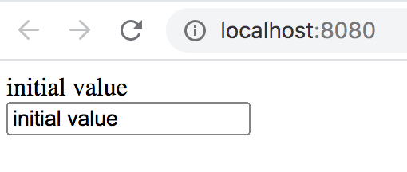

# Dealing with state

Follow me on [Twitter](https://twitter.com/chris_noring), happy to take your suggestions on topics or improvements /Chris

> TLDR; State is how we can change the data inside of a component. You used to only be able to change state from class based components. However, thanks to Hooks, you can use functional components as well. 

In the former section we covered `props`, attribute on your components that you could read and render inside of a component, [Props](/props.md).

## Props can't be changed

`Props` are great, but lack the ability to be changed in the component they are added in. 

Let's look at the following example to see where the problem is:

```js
import React, { Component } from 'react';
import PropTypes from 'prop-types';

class Element extends React.Component {
  static propTypes = {
    name: PropTypes.string
  }

  // THIS WON'T WORK
  changeName() {
    this.props.name = 'new name';
  }

  render() {
    return (
      <div>{this.props.name}</div>
      <button onClick={() => this.changeName()} ></button>
    )
  }
}
```

In the above example, you try to change the `name` property but React won't let us do that. Instead we need to rely on `state` to do so.

## Creating the state

There are two ways we can create the state:

- **In the constructor**. By declaring a field on the class called `state`, you can assign to it in the constructor and thereby construct an initial state, like so:

   ```javascript
   constructor() {
     this.state = {
       cart: [],
       discounts: []
     }
   }
   ```

- **Create an inline field**. Instead of creating the field `state` in the constructor, you an instead create an inline field that you then can set. Below is an example how to do so:

    ```js
    class Element extends React.Component {
      state = {
        field : 'some value'
      }
    }
   ```

## Accessing the state

Accessing the state is done by calling by referring to `this.state` and the name of the property. Here's an example

```javascript
this.state.nameOfYourProperty
```

### Destructuring

If you have many properties to render, you might want to use _destructuring_ to _dig out_ the values. The benefit of doing so is that you don't have to keep referring to the properties you are interested in as `this.state.something`. Consider the following example, a render section in a component:

```js
  render() {
    return (
      <React.Fragment>
        <div>{this.state.name}</div>
        <div>{this.state.description}</div>
      </React.Fragment>
    )
  }
```

Let's apply _destructuring_ to clean this up. You can write the code like so:

```javascript
  render() {
    const { name, description } = this.state
    return (
      <React.Fragment>
        <div>{name}</div>
        <div>{description}</div>
      </React.Fragment>
    )
  }
```

Note how the following line _digs out_ the information you are interested in:

```javascript
const { name, description } = this.state
```

You can then refer to your variables in the render section as `name` and `description` without needing to append `this.state` to it.

> TIP: Using destructuring is good pattern to use and can be used to dig out information from `this.props` as well.

## Changing the state

To change state, you need to work with `this.state` over `this.props`. You also can't reassign content to this `this.state`, like so:

```javascript
// wouldn't work
this.state.name = 'new value';
```

Instead, you need to use the method `setState()`. The method `setState()` is smart, it accepts whole or part of the state to do the necessary changes. Imagine you've initalized a state looking like this:

```javascript
this.state = {
  name: 'initial name',
  description: 'initial description'
}
```

To change your state you need to call the `setState()` method and provide it the _slice of change_ you want to change here:

```js
this.setState({
  name: 'new name'
})
```

This instruction will only affect the `name` property, `description` will be left untouched.

Note, The change is asynchronous, it doesn't happen straight away. If you need to know exactly when the change has been carried out, use a callback as the second parameter to `setState()` like so:

```javascript
this.setState({
  name: 'new value'
}, function() {
  // change has happened here
})
```

## Exercise - use state

In this exercise you will create a component that has the ability to change its state. In React, there's the notion of smart and dumb components. The former is able to change its state and the latter is only able to render data.

1. Create a new project by running the command `git clone`:

   ```bash
   git clone https://github.com/softchris/react-starter-project my-component-app
   cd my-component-app
   ```

   This starter project is based on the tutorial in [Setup with Webpack](./setup.md).

1. Run `npm install` to install all dependencies:

    ```bash
    npm install
    ```

1. In the _src_ directory create the file _Person.js_ and give it the following content:

    ```js
    import React from 'react';
    
    class Person extends React.Component {    
      constructor() {
        this.super(); // this call is needed to turn it into a React component
        this.state = {
          name : this.props.name 
        }
      }
    
      changeName(evt) {
        // implement
        console.log(evt);
      }
    
      render() {
        return (
          <div>{this.props.name}</div>
          <div><input type="text" onChange={(evt) => this.changeName(evt)} value={this.state.name} /></div>
        )
      }
    }
    export default Person;
   ```

   What you have is a component with an input field. The idea is for the input field to sync its state, towards the component, every time the user types in the field. 

1. Open up _index.js_ and locate the part of the code that looks like so:

    ```javascript
    ReactDOM.render(
      <div>{title}</div>,
      document.getElementById('app')
    );
    ```

    and change it to look like so:

    ```javascript
    ReactDOM.render(
      <Person />,
      document.getElementById('app')
    );
    ```

    Additionally, add the following import, to the top of the file:

    ```javascript
    import Person from './Person';
    ```

    What you've done is to ensure your `Person` component is rendered out in your app.

1. Try out the current code by running `npm start` at the console:

   ```bash
   npm start
   ```

1. Open up a browser and navigate to **http://localhost:8080**. You should see the following:

   

   Try editing the text field. Note how nothing changes. What you want to happen is that for every character you enter in the input field. The reason is that you've assigned `this.state.name` as the value of the input element like so:

   ```html
   <input onChange={(evt) => this.changeName(evt)} value={this.state.name}>
   ```

   The method `changeName()` is called every time you enter a key, but because the method doesn't change the state, nothing happens. Let's change that fact next.

1. Let's add some code to make the input field work. Open up _Person.js_, locate the `changeName()` method and change its implementation to the following code:

   ```javascript
   changeName(evt) {
      this.setState({
        name = evt.target.value
      })
   }
   ```

   Save the changes and return back to your browser window.

1. Try change the values in the input field. It should be working now, success!

   By ensuring you update the state every time the user interacts with the text field you're able to keep the user interaction in sync with the component state.

## Solution

👉 [Check out this solution](./solutions/state/my-component-app)

## Summary

You've learned how you can change the state of an app by using the `this.state` construct and the method `setState()`.
